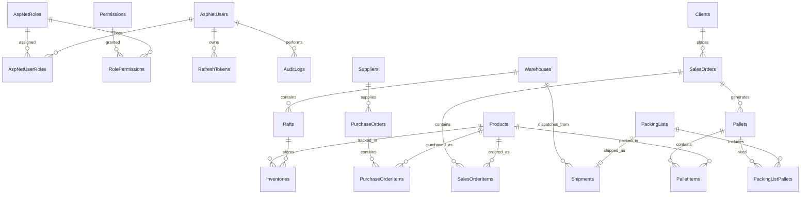

# Database Diagram — Warehouse Management System

## Përmbledhje

| Databazë | Përdorimi | Tabela / Koleksione |
|----------|-----------|---------------------|
| **SQL Server** | Të dhënat relacionale | 29 tabela |
| **MongoDB** | Njoftimet në kohë reale | `Notifications` |

---

## Tabelat e Detyrueshme (10)

| Tabela | Entiteti | Qëllimi |
|--------|----------|---------|
| `AspNetUsers` | Users | Llogaritë e përdoruesve |
| `AspNetRoles` | Roles | Admin, Manager, Client |
| `AspNetUserRoles` | UserRoles | Lidhja user ↔ role |
| `Permissions` | Permissions | Lejet e aksesit |
| `RolePermissions` | RolePermissions | Lejet për çdo rol |
| `RefreshTokens` | RefreshTokens | Sesionet aktive |
| `AuditLogs` | AuditLogs | Gjurmim veprimesh |
| `Notification` | Notifications | Njoftime |
| `Settings` | Settings | Konfigurime globale |
| `Files` | Files | Metadata e skedarëve |

---

## Tabelat e Domenit

| Tabela | Përshkrim |
|--------|-----------|
| `Warehouses` | Magazinat |
| `Rafts` | Raftet |
| `Products` | Produktet |
| `Inventories` | Stoku |
| `Suppliers` | Furnitorët |
| `Clients` | Klientët |
| `PurchaseOrders` / `PurchaseOrderItems` | Porosi blerjeje |
| `SalesOrders` / `SalesOrderItems` | Porosi shitjeje |
| `Pallets` / `PalletItems` | Paletat |
| `PackingLists` / `PackingListPallets` | Packing lists |
| `Shipments` | Dërgesat |

---

## Entity Relationship Diagram (ERD)



---

## Relacionet Kryesore

```
Warehouse (1) ──→ (N) Raft (1) ──→ (N) Inventory
                              └──→ (N) Pallet (1) ──→ (N) PalletItem → Product

Supplier (1) ──→ (N) PurchaseOrder (1) ──→ (N) PurchaseOrderItem → Product
Client (1) ──→ (N) SalesOrder (1) ──→ (N) SalesOrderItem → Product
SalesOrder (1) ──→ (N) Pallet
PackingList (1) ──→ (1) Shipment → Warehouse
```

---

## MongoDB — Notifications

```
Collection: Notifications
{ _id, userId, type, title, message, isRead, createdAt }
```

---

## Migrimet

```powershell
dotnet ef database update
```

Migrimet ndodhen në `Migrations/`:
- `20260604232508_InitialCreate` — skema e plotë
- `20260607135400_SyncPendingChanges` — përditësim i vogël
